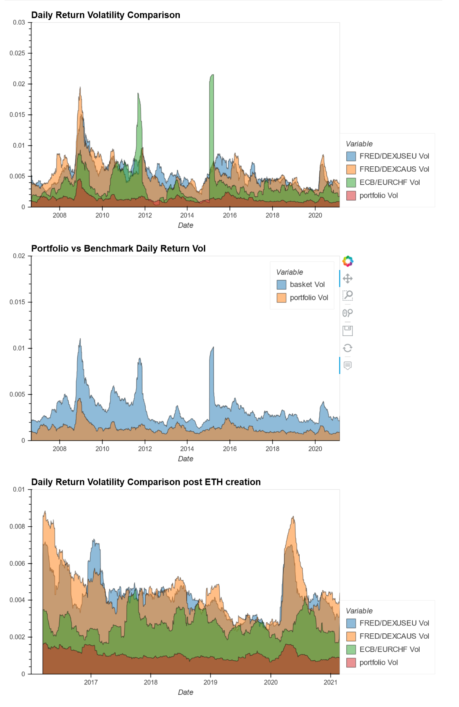
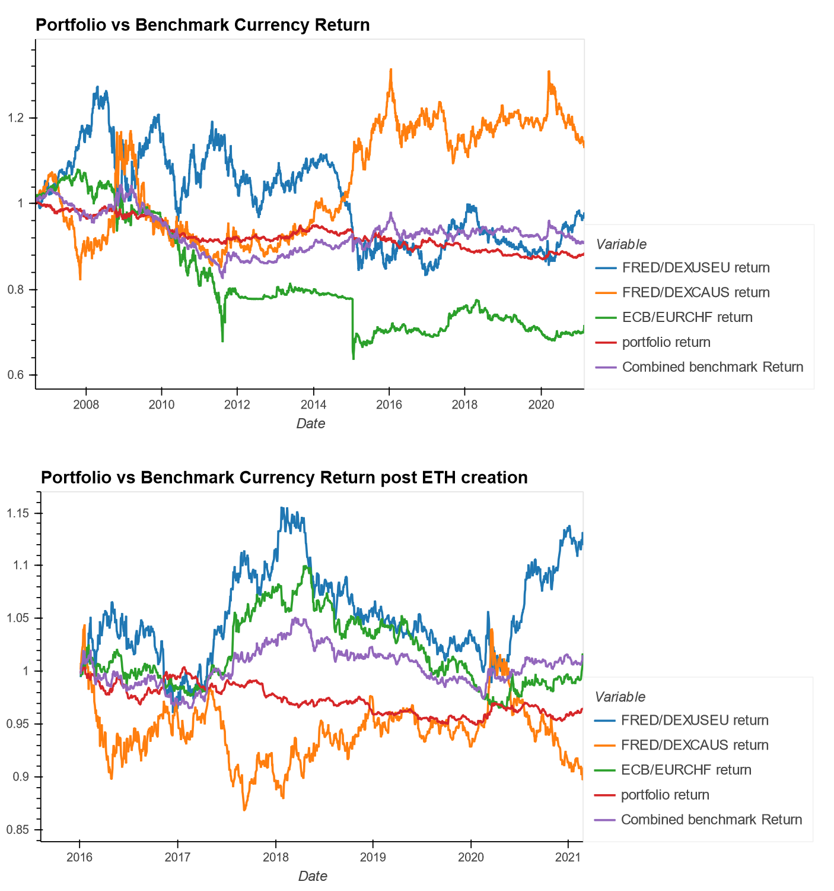

# SHAK Token

[](https://opensource.org/licenses/MIT)

The SHAK Token is the Stable Hyper Algorithmic Kryptocurrency. It is intended to be used as a stable alternative to store value as compared to fiat currencies, commodities, or even other stablecoins. Our cryptocurrency is backed by a basket of different currencies and other assets. With our algorithms continuously balancing the basket, we aim to provide a store of value that stays above the volatile fluctuations that impact commonly held assets.

## Table of Contents
---
- [Installation](#installation)
    - [Balancing Algorithm](#balancing-algorithm)
    - [Placeholder](#placeholder)
- [Balancing Methodology](#balancing-methodology)
    - [Country Indicator Balancing](#country-indicator-balancing)
    - [Continuous FX Balancing](#continuous-fx-balancing)
- [SHAK Oracle](#SHAK-oracle)
- [Smart Contracts](#smart-contracts)
- [User Guide](#user-guide)
- [Contributors](#contributors)

## Installation
---

Beyond cloning the repository, in order to run the included scripts, some installation steps are required. They are listed below by section, with the specific scripts specified as well. Most of these can be installed with the [Anaconda](https://www.anaconda.com) package (as indicated with an asterisk).

## Balancing Algorithm

Scripts covered: [countryweight.py](countryweight.py), [Stable_coin.py](Stable_coin.py)

### Key Python Libraries Required:
|Library|Command Line Install|
|-------|-----------------------------|
|[Pandas*](https://pandas.pydata.org/getting_started.html) | ```conda install pandas``` |
|[Numpy*](https://numpy.org/install/)  | ```conda install numpy```  |
|[ScikitLearn*](https://scikit-learn.org/stable/install.html#)|```pip install -U scikit-learn```|
|[Quandl](https://pypi.org/project/Quandl/)|```pip install quandl```|

<br/>

## Smart Contract and Oracle Deployment

Scripts covered: [SHAK_price_oracle.py](SHAK_price_oracle.py), [SHAK_monitor.py](SHAK_monitor.py)

### Key Python Libraries Required:
|Library|Command Line Install|
|-------|-----------------------------|
|[Web3.py](https://web3py.readthedocs.io/en/stable/) | `pip install web3`|
|[Flask](https://pypi.org/project/Flask/) | `pip install Flask` |

<br/>

### Env Variables Required:
These env variables require definition prior to running these scripts:
- `CMC_PRO_API_KEY =` requires creating a free account at [CoinMarketCap](https://pro.coinmarketcap.com/)
- `WEB3_INFURA_PROJECT_ID =` for local testing, create a free account at [Infura](https://infura.io/)
- `WEB3_PROVIDER_URI = https://kovan.infura.io/v3/aa3c1e7b65054c8595581a4241ff7b40`
- `SHAK_TOKEN_ADDRESS = 0xTBD`

<br/>

## Balancing Methodology
---


Stability is the cornerstone of our cryptocurrency. As such, we are evaluating the currency basket we hold daily. In addition to monitoring the interday fluctuations in exchange rates, we also take a long-term approach by looking at key indicators for the countries of our currencies to anticipate future currency movements. This country indicator balancing is done at a lesser frequency as these indicators are only released annually.

### Country Indicator Balancing

All country indicator information is pulled via the [World Bank API](https://datahelpdesk.worldbank.org/knowledgebase/topics/125589-developer-information). The indicators currently used are [Gross Domestic Product](https://en.wikipedia.org/wiki/Gross_domestic_product) (GDP), GDP Growth (Year over Year), GDP per capita, Inflation based on [Consumer Price Index](https://en.wikipedia.org/wiki/Consumer_price_index) (CPI), and Unemployment rate. These indicators going back 20 years are pulled for all countries that are represented in the currency basket. 

Matched against this set of historical indicators are the annualized volatility of each currency against the USD (as provided by [Federal Reserve Economic Data](https://fred.stlouisfed.org) (FRED)). These indicators and annualized volatility numbers then go to train a linear regression machine learning algorithm (a deep learning model and other forms of linear regression were also evaluated in the process). This trained model is used on the most recent set of indicators for the countries represented in the currency basket to provide projected annualized volatility for the next year. These projections are fed into the weighting recommendation model. 

This model takes in the annualized volatility and removes the most volatile 25% of projections and sets the weighting to 0. Then based on the remaining volatility associated with each country/currency pair, it assigns weights for the portfolio (with higher weight assigned to lower projected volatility). These weighting recommendations then form the baseline for the continuous FX balancing algorithm that will be explained in the next section.

For example, given a portfolio of 20 non-pegged currencies, after training and testing the model, the recommended breakdown of the currencies are as follows:


### Continuous FX Balancing

A master SHAK currency basket is created through Quandl API calls including currency alternatives, Gold and BTC. Using the Country Indicator Balancing weights, daily returns, and two features a low volatility, mean reverting algorithm is produced. An additional annualized volatility filter removes hyperinflationary and secular trending currencies (Venezuela, Gold and BTC this year). Bollinger band and daily return volatility averages create signals when outside of a standard deviation measure which are then utilized by a Random Forest Model to produce a synthetic portfolio currency value.

In validating the efficacy of the algorithm, the following output was produced:
```
The percentage of days the portfolio has had low volatility:
Portfolio to FRED/DEXUSEU beta    0.965986
Portfolio to FRED/DEXCAUS beta    0.976474
Portfolio to ECB/EURCHF beta      0.994048
Combined Benchmark Beta           0.999433
The percentage of days the portfolio has had extremely low correlation (beta .5 SD) 
Portfolio to FRED/DEXUSEU beta    0.207200
Portfolio to FRED/DEXCAUS beta    0.274943
Portfolio to ECB/EURCHF beta      0.363662
Combined Benchmark Beta           0.285431
```

Also included in the repository is a [Basket Analysis notebook](basket_analysis.ipynb) for the CIO and marketing team to analyze the efficacy of the algorithm in regards to daily returns, volatility, and beta relative to a benchmark of currencies. Post Ethereum charts are also included given the current nature of the SHAK coin's native point of exchange. There are also a variety of callable methods within the [Stable_coin.py](Stable_coin.py) file that are meant to be used to remove/add filters, change benchmark baskets, and quickly review Random Forest results.

The resulting graphs produced are as follows:

### **Volatility Comparisons**
<br/>



### **Returns Comparisons**
<br/>



## SHAK Oracle
---


The Oracle's primary function ([SHAK_price_oracle.py](SHAK_price_oracle.py)) is to provide an API end point to serve requests for latest calculated basket price in wei from the basket balancing scripts. This API is hosted with Flask. The API endpoint is accessed by the SHAK token's Solidity contract to determine current exchange price (wei).

The basket price and balancing scripts are calculating price in USD. The SHAK token smart contracts transact using wei. To convert latest basket USD price to current wei price, the Oracle fetches per request the latest ETH-USD exchange aggregated rate from Coin Market Data pro API, and the latest wei-ETH ratio from Web3 Infura.io mainnet API. 

To allow websites and fund balancing operations to real-time monitor the total SHAK tokens active, the separate [SHAK_monitor.py](SHAK_monitor.py) invokes TotalCount functions within the SHAK contract to read number of active Tokens.


## Smart Contracts
---


The smart contract is acting as the frontend for buying and redeeming our tokens. It will be the interface which clients will buy and redeem our tokens. Our token are built to ERC20 standard, as well as utilzed safemath for security.

Operations

The contract holds funds in ETH for day-to-day transactions. The contract will not allow token redemption which it could not cover with available fund, and will advice client to contact our office. 

As a client initiated transaction with the contract, the contract will updates the rate with the latest rate posted on our server through Oraclize and use that rate to convert tokens to ETH, vice versa. Moreover, the contract will log each transaction (buying, redeeming, transferring, and oraclize pull) to the chain as our transaction ledger.

## User Guide
---
Clients will interact with our smart contract in 3 ways: Buy Tokens, Redeem Tokens, Transfer Tokens, and Check Token Balance.
- Buy Tokens
    - The contract will only use message sender as source of ETH for transaction and message value as amount of ETH in wei to buy tokens.
    - Client will specify the wallet which SHAK token would be place. 
    - If we have already reached the maximum number of tokens, the contract will not sell any token to message sender, and return the remaining value and gas. If we have not reached maximum number of token, the contract will sell the remaining amount up to maximum number of token or total worth of message value, whichever is less.
    - Any remainder left from converting to SHAK token will be return to message sender.
- Redeem Tokens
    - The contract will assume that the message sender is the token owner who will specify the number of tokens to redeem.
    - If token owner doesn’t have enough tokens to redeem, the transaction is terminated. Otherwise, the contract will update the conversion rate, then send ETH back to the owner. If the contract doesn’t have enough ETH to cover this redemption, then, it will notify the contract owner to contact our office. 
- Transfer Tokens
    - The contract will assume that the message sender is the token owner who will specify the number of tokens to redeem and to whom to transfer the tokens.
    - If token owner doesn’t have enough tokens to transfer, the transaction is terminated.
- Check Token Balance
    - The contract will assume that the message sender is the token owner. It will return the number of tokens registered to the owner.

Operator will be able to check conversion rate, check number of token sold, remaining token, maximum number of tokens, check contract’s ETH balance, set URL for oraclize and withdraw ETH from the contract.
- Withdraw funds
    - Only the "fund wallet" address specified at contract construction can withdraw ETH.
    - Operator will specify how much ETH to withdraw in wei, then the contract will transfer funds to the fund wallet. If the contract doesn't have enough to send, then the operation is terminated.

## Contributors
---
|Doc Fern|Albert Kong|Thee Sanpitakseree|Henry Schrader|Kiel Wheat|
|:------:|:---------:|:----------------:|:------------:|:--------:|
|| | | | |
